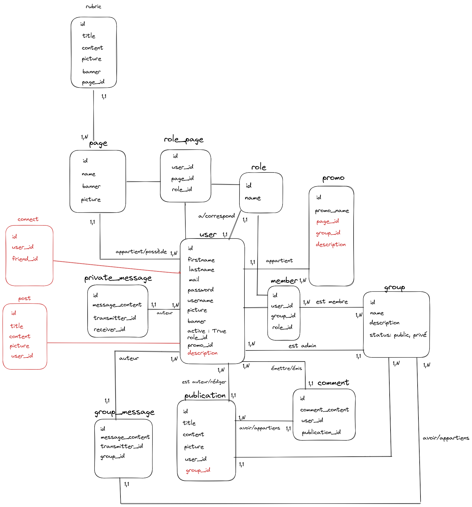

# MCD

# Controllers

# rubricController => Gérer la table rubric

|Methodes| url | controllers |commentaires|
|--------|-------------|-------------|------------|
| GET  | /rubric/get/:id | rubricController | récupérer toute les rubriques d'une page |
| POST | /rubric/add/:id_page | rubricController | ajouter une rubric sur une page |
| POST | /rubric/delete/:id | rubricController | supprimer une rubric |
| POST | /rubric/update/:id | rubricController | modifier une rubric |

# pageController => gérer la table page

|Methodes| url | controllers |commentaires|
|--------|-----|-------------|------------|
| GET | /page/get/:id | pageController | afficher la page d'un utilisateur |
| POST | /page/add | pageController | créer une page |
| POST | /page/update/:id_page | pageController | si admin modifier le contenu d'une page |
| POST | /page/delete/:id_user | pageController | si admin supprimer une page |

# groupController => gérer les groupes

|Methodes| url | controllers |commentaires|
|--------|-----|-------------|------------|
| POST | /group/create | groupController | Créer un groupe public ou privé |
| POST | /group/join/:id_group | groupController | S'inscrire à un groupe public ou privé |
| POST | /group/relation/invite/:group_id/:user_id | groupController | Inviter ses relations au groupe |
| POST | /group/member/accept/:group_id/:candidate_id | groupController | Accepter ou refuser les candidatures à un groupe privé ou une invitation a rejoindre si l'utilisateur est admin |
| POST |/group/member/update/rights/:group_id/:user_id | groupController | Changer les droits d'un utilisateur si admin (admin/membre) |
| POST | /group/member/banish/:group_id/:user_id | groupController |Si admin exclure un membre d'un groupe |
| POST | /group/update/info/:group_id | groupController | Si admin changer les informations du groupe (nom, description, image) |

# roleController => gérer les rôles des utilisateurs 

|Methodes| url | controllers |commentaires|
|--------|-----|-------------|------------|
| POST | /role/update/:id_role | roleController | si le user est admin modifier un rôle |
| POST | /role/delete/:id_role | roleController | si le user est admin supprimer un rôle |
| POST | /role/add  | roleController | si le user est suppert admin ajoute un rôle |

# promoController => gérer les promos

|Methodes| url | controllers |commentaires|
|--------|-----|-------------|------------|
| GET  | /promo/get | promoController | afficher toute les promos |
| GET  | /promo/get/post/:id | promoController | afficher le détail d'une promo, lorsque l'on clique sur une promo avec la liste des élève |
| POST | /promo/add | promoController | ajouter une promo |
| POST | /promo/delete/:id_promo | promoController | supprimer une promo |
| POST | /promo/update/:id_promo | promoController | mettre à jour une promo |

# commentController => gérer les commentaires d'une publication 

|Methodes| url | controllers |commentaires|
|--------|-----|-------------|------------|
| GET | /comment/get/:id_publication | commentController | récupérer les commentaires d'une publication |
| POST | /comment/add/:id_publication |  commentController | ajouter un commentaire sur une pubpication
| POST | /comment/update/:id_comment | commentController | si autheur du commentaire modifier le commentaire |
| POST | /comment/delete/:id_comment | commentController | si autheur ou admin Supprimer un commentaire |

# messageController => gérer les messages privé et public entre utilisateurs

|Methodes| url | controllers |commentaires|
|--------|-----|-------------|------------|
| POST | /message/:id_receiver/:id_transmitter/ | messageController  | envoyer un message privé |
| GET  | /message/:id_receiver/:id_transmitter/  |  messageController  | recevoir et afficher un message privé reçu # ?|
| POST | /message/update/:id_message | messageController | si auteur du message modifier un message |
| POST | /message/delete/:id_message | messageController | si auteur du message supprimer un message |

# userController => gérer les utilisateurs

|Methodes| url | controllers |commentaires|
|--------|-----|-------------|------------|
| GET  | /user           | userController | Afficher les informations d'un utilisateur |
| POST | /profile/update | userController | Modifier ses informations personnelles |
| POST | /profile/deactivate | userController | Désactiver son compte |
| POST | /profile/reactivate | userController | Réactiver son compte |
| POST | /profile/delete | userController | Supprimer son compte |
| POST | /profile/signup | userController | Créer un compte |
| POST | /profile/login | userController | Se connecter |
| POST | /profile/logout | userController | Se déconnecter|
| GET | /profile/relation/search/:params | connectController | rechercher une relation||l

# feedController => gérer le contenu d'un user

|Methodes| url | controllers |commentaires|
|--------|-----|-------------|------------|
| GET | /profile/feed/get/:id_user | feedController | toute les publications d'un user |
| POST | /profile/feed/add/:id_user | feedController | ajouter le feed d'un user |
| POST | /profile/feed/delete/:id_feed | feedController | supprimer le feed d'un user |
| POST | /profile/feed/update/:id_feed | feedController | mettre a jour le feed d'un user |

# connectController => gérer les connexions entre user

|Methodes| url | controllers |commentaires|
|--------|-----|-------------|------------|
| GET | /relations/search  | connectController | afficher toutes ses relations d'un user |
| POST | /relation/add/:id_user | connectController | ajouter un user comme relation |
| POST | /relation/delete/:id_user | connectController | supprimer une relation |

# publicationController => gérer les publications

|Methodes| url | controllers |commentaires|
|--------|-----|-------------|------------|
| POST  | /publication/add/:id_group | publicationController | publier la publication dans un groupe |
| GET  | /publication/get/:id_publication | publicationController | afficher la publication en elle-même |
| POST | /publication/update/:id_publication | publicationController | modifier la publication |
|  POST  | /publication/delete/:id_publication | publicationController | supprimer la publication |
| GET  | /publications/get/:id_group | publicationController | afficher les publications du groupe en question | 

# memberController => gérer les membres

|Methodes| url | controllers |commentaires|
|--------|-----|-------------|------------|
| POST | /group/join/:id_group | memberController | rejoindre un groupe |
| POST | /group/quit/:id_group | memberController | Quitter un groupe |

